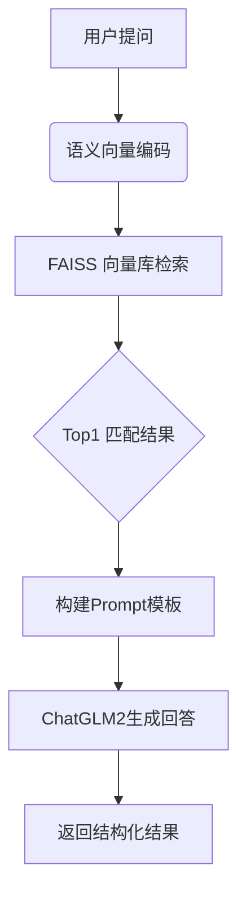

# 🚀 物流知识智能问答系统 - LogisticsQA

**让物流信息查询像聊天一样简单！** 📦✨  
基于大语言模型 + 向量检索的智能问答解决方案，快速定位物流信息中的关键内容 🔍

---

## 🎯 项目特色

- **⏱️ 极速响应**：FAISS 向量库实现毫秒级信息检索
- **📚 语义理解**：M3E 中文嵌入模型精准捕捉上下文
- **💬 智能对话**：ChatGLM2-6B 大模型生成自然流畅回答
- **🛠️ 开箱即用**：模块化设计，五分钟快速部署

---

## 🧩 功能演示


**用户提问**：  
`我买的商品来自于哪个仓库，从哪出发的，预计什么时候到达？`

**系统回答**：  
🎯 您的包裹正在飞奔而来！  
🚚 出发地：广州仓库  
📅 启程时间：2023年1月20日  
⏰ 预计到达：1月23日（3天运输时长）  
📍 目的地：重庆  
📦 运输方式：陆运  

---

## 📦 技术栈

```bash
- LangChain 🦜️🔗
- FAISS 🧠
- HuggingFace Transformers 🤗
- ChatGLM2-6B 🧠
- M3E 中文嵌入模型 🇨🇳
```

---

## 🛠️ 快速开始

### 1. 安装依赖
```bash
pip install -r requirements.txt
pip install langchain-community unstructured faiss-cpu
# 处理文档需要
pip install python-magic python-magic-bin
```

### 2. 运行准备
```bash
# 下载模型文件
git lfs install
git clone https://huggingface.co/THUDM/chatglm2-6b ./model_files/

# 准备物流文档
echo "广州仓库 发货时间 2023-01-20..." > 物流信息.txt
```

### 3. 启动系统
```python
# 生成向量库
python get_vector.py

# 运行问答系统
python Knowledge_QA/main.py
```

---

## 🧠 核心逻辑



---

## 💡 使用示例

```python
from Knowledge_QA.main import qa

# 像朋友一样提问！
response = qa("我的包裹现在到哪了？")
print(f"📦 物流小助手：{response}")
```

---

## ⚠️ 重要提示

1. 🗺️ **模型路径配置**  
   修改 `ChatGLM2.load_model()` 为本地模型路径：  
   `llm.load_model("/path/to/chatglm2-6b")`

2. ✂️ **文本分割优化**  
   根据文档特性调整 `chunk_size`：
   ```python
   # 推荐值：100-500字符
   TextSplitter(chunk_size=200)
   ```

3. ⚡ **性能优化建议**  
   ```python
   # 在模型加载时添加参数
   llm.load_model(..., device_map="auto", torch_dtype=torch.float16)
   ```

---

## 📜 开源协议

本项目采用 [MIT License](LICENSE)，拥抱开源，共同进步！ 🤝

---

**让物流信息流动起来** 🌍✨  
有任何建议欢迎提交 Issue 或 Star ⭐ 支持我们！
